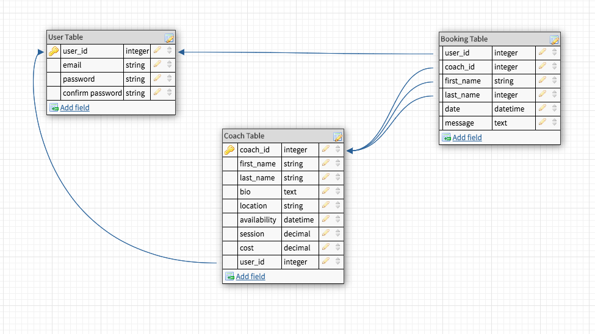

# README

Link to live application: https://bball-app.heroku.com

Link to Github repo: https://github.com/augam8/bball

**Description of Ballers Alliance App**

Ballers Alliance App is an online marketplace app that connects basketball players and coaches. The purpose of this app is to provide a way for the two types of users to network in a convenient and easy way. 

**Target Audience** 

The target market for this app are parents with young children that have passion for basketball. These families have busy lifestyles but at same time they want to encourage their kids to keep fit and active by playing the sport. The young kids are dedicated who love the sport and want to develop and be better players. The parents see their kids potential and want to take this further than just a fun activity game. 
The other target market for this app are coaches between the ages of 18-60 that also have a passion for basketball and looking for a way to share their knowledge and skills. 

**Functionality**

The aim of the app is to make the online user experience simple, easy and effective. This saves time for both players and coaches to interact and manage their time effectively. The goal is a registered user can book a coach and a coach can upload their profile.

**Features of this app**

Secure log in, Sign In and Sign Up 
Validation using Devise ( Authentication and Authorisation )
Personalised Coach Profiles
Profiles upload with AWS image storage
Book Coaches for training sessions
View a list of bookings
View Coaches profiles
View User account
Stripe for payment transactions (futureimplementation)

**Techstack**

Front end - HTML, CSS, SASS, BOOTSTRAP

HTML - stands for HyperText Markup Language is a language that is used to create web pages. Used mostly for structure, capable of basic styling for elements.
CSS - Cascading Style Sheets is a language used to style a web-page. Makes HTML look prettier. 

SASS - Syntactically Awesome Style Sheets is used to add some additional features to CSS.

Back end 
Ruby - programming language  
Ruby on rails - framework structure for ruby

Gems - are third party libraries for ruby

Database - PostgreSQL with Active Record

Heroku - for deployment

**Configuration / Installation Instructions**

Clone the github repository and install the files to the directory you wish to save the files. https://github.com/augam8/bball.git

1.Run ‘bundle install’ in the terminal to install the app and its dependencies

2.Run ‘rails db:reset’ to reset the database

3.Runs ‘rails s’ to run the server

4.On your browser to view the web app by navigating to http://localhost:3000

5.Sign Up and register and browse all the website

**Sitemap**

**Identification of the problem you are trying to solve by building this particular marketplace app.**

The justification for a service that brings coaches and players is there already as for every sport out there there is a coach present. The problem I am trying to solve in this app is the hassle and time inconvenience to find and connect coaches and basketball players in an easy and effective manner. Finding a basketball coach is hard, they are often not advertised or they are already coaching at a sports venue. Finding an available coach for extra training is not very easy to find. Often you will need to search through a bunch of websites only to find a coach for other sports types. Or you will have to ask around the sports community if they know anyone who is coaching privately. This is a really big problem because most people have busy lifestyles and their time is very limited due to work commitments and other factors.

Now for the coaches side, the skills of a coach is very valuable and they are most often under utilised because most of the time they are limited to coach only at a sports venue where sports clubs are registered. There are many coaches out there who would be willing to coach privately if they knew how they can represent themselves without having to go through networking to advertise themselves. Another problem is that it can be costly to advertise yourself as a coach via traditional advertising like in  a business that way. There are also many senior basketball players out there that can become a coach and earn extra money on the side while sharing their skills or give back to the game they love. 

So if this app can be pitched to the basketball community it will open up a whole new avenue for coaches and players to network and collaborate.

We should be promoting coaches to athletes because we Australians love sports and we are very competitive globally. We should be encouraging the young generations to follow their passion through a sport like basketball and aspire to be the best they can be and who knows one day they may become our latest basketball superstar like Ben Simmons or the late legend Kobe Byant. 

There is clearly a need to develop this type of marketplace app as it caters a niche in the basketball market and we can fully utilize the skills of coaches and senior basketball players.

By creating this app the basketball players and coaches can network and collaborate with each other, alleviate their planning time and deliver high quality training to basketball athletes.

**Why is it a problem that needs solving?**

It is a problem that needs solving because it is hard to find reliable coaches and alot of the time is wasted sifting through websites after websites. I myself was a victim of this inconvenience because my kids both play basketball. They love the game and I could see they really want to work hard to improve their game. They asked me if there was a way they could go for extra training. The solution to that was to find a coach. The problem was it was too painstaking  job to find a coach we had to sift through a bunch of websites that offered basketball coaching. This task took so long as most websites had coaches for different types of sports. We knew that there are many coaches willing to teach but it was hard to find them. I know many parents experience the same thing as this is always asked among each other during the game and training sessions as their kids also want to train more. The sports clubs only offered training day once a week and that was not enough. 

This inspired me to develop this app to fill the gap so that coaches and basketball players can find each other and connect effectively. 

For parents and basketball players this will solve the problem of the hassle and time consuming task to find a basketball coach. It will be a painless appointment booking system as the availability times, cost and location are already set. Upon signing up basketball players can view available coaches and their details and book them straight away. 

For Coaches there are many advantages for them that this app brings. One of the biggest benefit is that it opens up a new way for them to offer their skills as a Coach and motivate players to perform better. Coaches are great example of a good leader and we need them to inspire the young generations. This also offers a way for them earn extra income teaching their passion and getting paid for it at the same time. Coaches don’t need to pay a lot of money to advertise themselves, they are getting clients which are ready to train and wants them, its a laser targeted marketing for them. They don’t have to go out and look for clients, they can set their own time and cost. The other benefit for coaches is that they need not to juggle multiple texts calls and bookings to confirm training and collecting payments. More importantly coaches can focus on training their clients without worrying about all the hassles of running a business. 

The other benefit I have found is that it also meets our needs as a developer to seek out a niche such as this that could help many athletes and coaches out there and utilise their skills.

**User Stories**

**User Model**

has_many :users
has_many :coaches
has_many :bookings
has_and_belongs_to_many :bookings
The User has many Coaches, user can train with many coaches. A User also can have many bookings, user can book as many coaches they want.

**Coach Model**
belongs_to :user
has _many :bookings
Has_one_attached :image
Coach has one attached image uploaded on their profile. Coach has many bookings. Coach belong to user once they have been booked.

**Booking Model**
has_many :booking
belongs_to :user
belongs_to :coach
Booking belongs to the user - this will give the user the information regarding the details of their bookings. Booking also belongs to a coach - this model gives information to the coach about their bookings. 

**WIREFRAMES**
I developed the wireframes using an online tool called balsamiq mockups. The wireframes are for desktop view and mobile view.

**Explain the different high-level components (abstractions) in your app**

There are a few high level components for this app. Here is an outline of each them below;

**Active Record**

Active Record is one of the high level components of this app, it is the interaction between the app and the database. Active Record abstract the code in the app so that it can talk or manipulate the database which will then allow us to use this data within our app. The Active Record maps the associations between the models and the data in our app. It then validates the models before it is transpired into the database.

**Form Helpers**

I used form helpers in my app to collect data from the tables I created. By using the form_with to display the forms this collected the data in an efficient way. I also used this form in partials so I can reuse them inside my app without having to redo the forms in the other pages of my app. 

**Active Storage**
Active storage is another high level component in my app, it helps to upload my images and stores them in the cloud. The cloud storage I used is the Amazon S3. There are also many other cloud services out there. 

**Devise**
Devise is a gem which is a third party library that can be installed inside ruby. Devise is used to authenticate and sign up users to my app. Devise creates my table for users and gives them an email and password fields.

**Stripe**

Stripe is also another high level component in this app but i did not have the time to implement it. It is a platform used to securely process transaction payments between users.

**Detail any third party services that your app will use**

The following are the third party services that this app used;

**For Image Upload - AMAZON AWS S3** 

AWS S3 is an online cloud service that allows you to store and upload images. The images uploaded by users on this app are stored via this cloud service. 

**For Deployment - Heroku**

Heroku is an online service application that I used to deploy this app so it is viewable online. By using  this free service I do not  need to manage  my own servers and other ongoing operations, or to scale if needed. I can push my code directly from github to Heroku’s platform where it will handle the deployment of my app.

**For Data Storage - PostgreSQL**

PostgreSQL is a database system that is used to hold the data of this app. It works very smoothly when building an app with Ruby on Rails which is the framework of this app.

**For Version/Source Control - Github**

A repository is created on Github to push the code there in preparation for deployment.

**Devise**

Devise is a third party gem in ruby and used to authenticate and sign up the users to this app. 

**App DB Designer**

Is an online website that I use to create my ERD diagram. https://app.dbdesigner.net

**Draw.io**

Is an online website I used to create my site map and user journey flow. https://draw.io

**For Payment - Stripe** *(future implementation)*

Stripe is to be used to process the payments between users.

**Describe your projects models in terms of the relationships (active record associations) they have with each other**

There are three models that have active record associations for this app; the user, the coach and the booking. These relationships can be described in the next question. 

*Please also see the ERD diagram for visual representation of this relationship*
####ERD DIAGRAM FOR BALLERS ALLIANCE

**User Model**

has_many :coaches
has_many :bookings
belongs_to :bookings
The User has many Coaches, user can train with many coaches. A User also can have many bookings, user can book as many coaches they want.

**Coach Model**

belongs_to :user
has _many :bookings
Has_one_attached :image
Coach has one attached image uploaded on their profile. Coach has many bookings. Coach belong to user once they have been booked.

**Booking Model**

belongs_to :user
belongs_to :coach
Booking belongs to the user - this will give the user the information regarding the details of their bookings. Booking also belongs to a coach - this model gives information to the coach about their bookings. 

**Discuss the database relations to be implemented in your application**

There are three main tables implemented on this app, the User Table, the Coach Table and the Booking Table.
Here is the rationale for the relationships of these tables;

__User Table__ - This table is shared among the user types which can be a coach, a player/athlete, or a parent. I created this table this way because they all have common fields and functions. Creating separate tables for each user types I believe is unnecessary and just creates more complexity in their relationships. This keeps the table simple and the user id is the primary key. This table was created by a gem called ‘Devise’ which generates a table with email and password fields.

__Coach Table__ - This table has all the information about the coach. The coach id is the primary key. This is related to the User table because a user can have many coaches to book. The user id becomes the foreign key in this table. Also the coach has a many to many relationship with the Booking table because a coach can only be booked many times.

__Booking Table__ - This table is associated to the user table because it holds all the information regarding the Users booking. The coach table is also related to the booking table as coach can see their bookings. The user can also see their bookings. Therefore this shows that there is many to many relationship between these tables. The user id becomes the primary key and user and coach table becomes the foreign key.
There is also two other table that was created automatically by running the gem ‘aws-sdk-s3’ -  

__Active Storage Attachment Table and Active Storage Blobs__ - these tables allow me to upload images through forms. It is a layer that is used to talk to AWS S3 API for hosting the images 

**Provide your database schema design**

**Describe the way tasks are allocated and tracked in your project**

Trello was used to manage the workflow in this application. The most important factor in this app is labelling each task by following the requirements set out for this project. After a task was done or rather started I moved these tasks to the next stages of completion. I used Trello at the beginning of this project but found myself constantly adding and editing requirements I had not listed. There was a lot of going back and forth with the tasks as I would start the next task even if I haven’t finished the other task. Alot of tasks were thought of and added to the trello board along the way. Towards the end I did not pay much attention to this trello and focus more on coding and trying to get my app working. I have summarised my journey with this app in weekly block below;

Here are some screen shot of my Trello and brainstorming shots while  creating this app.

 

**Week 1 (Thursday, Friday, Saturday)**

Wrote down all my ideas in a notebook
Decided to do app around basketball
Initial idea was too complicated
Used some colored pencils to map out what table would information it will have
Created Trello board and listed the task that was requirement for this project

**Week 2**
Attempted doing the wireframes 
Attempted the ERD diagram
Attempted some coding
confused over user functions
Pushing to github
Update trello

**Week 3** 
Attempted to answer some of the questions requirements
Redo tables and its fields
Worked on coding
More coding 
Frustrated with coding 
Restarted app 4 times
Redoing the ERD diagram
Updating trello

**Week 4** 
Started Bootstrap and CSS
Debug codes
Completing the questions required via readme
Push to heroku
Ran out of time to fix app some sections do not work
Presented the app
Submit the app
Still frustrated

